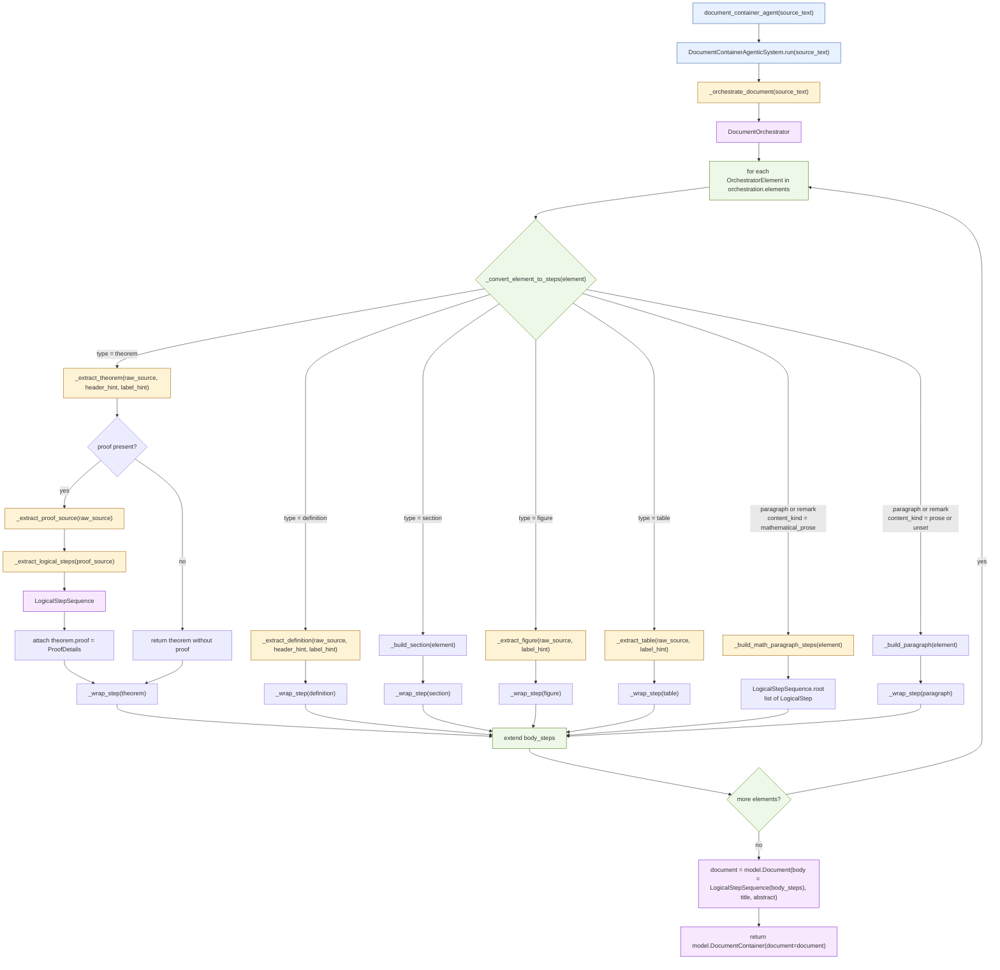

# DocumentContainerAgenticSystem Agentic Loop

This diagram is based on the current implementation in [agents.py](/Users/ajaykumarnair/AgentAI/agents.py:35). It focuses on the orchestration loop in `DocumentContainerAgenticSystem.run(...)`, the per-element routing logic, and the nested proof/logical-step extraction path.

## Reading Guide

- The outer agentic loop is `run(...)`:
  ingest document -> orchestrate into elements -> iterate over elements -> route each element -> append resulting steps -> build final `DocumentContainer`.
- The key routing decision happens in `_convert_element_to_steps(...)`:
  theorem/definition/figure/table go to specialized extractors, while paragraph-like elements branch on `content_kind`.
- `mathematical_prose` is special:
  instead of becoming a plain `Paragraph`, it is decomposed into a `LogicalStepSequence` and flattened into the main document body.
- The theorem branch has its own nested mini-loop:
  first extract the theorem statement, then optionally extract proof text, then parse that proof into logical steps, then attach it as `ProofDetails`.
